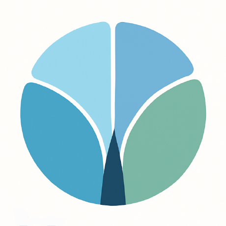

  

<h1 align="center">Chungun Network Plus</h1>

<i>Make Chungun people's life better.</i>

---

## 💡 소개

**Chungun Network Plus**는 현대청운고 학생들을 위한 다양한 정보 시스템을 설계하고 개발하는 조직입니다.  
우리는 "Make Chungun people's life better"라는 슬로건 아래, 더 나은 학교생활을 위한 솔루션을 만듭니다.

---

## 🚀 대표 프로젝트

| 프로젝트 이름 | 설명                                                    |
| ------------- | ------------------------------------------------------- |
| **Goorm**     | 주말 희망식 거래 플랫폼                                 |
| **Poorm**     | QR 코드를 이용한 주말 희망식 출석 체커                  |
| **Hoorm**     | 모의고사 후 귀사 도우미                                 |
| **Umjigim**   | 청운인의 청운인을 위한 청운인에 의한 동아리 홍보 사이트 |

---

## 📈 목표

- 학교 내 다양한 선택 상황의 시각화
- 학생 중심의 자동화 시스템 제공
- 신뢰성과 확장성을 고려한 프로젝트 운영

---

## 📬 연락처

- GitHub Organization: [Chungun Network Plus](https://github.com/Chungun-Network-Plus)
- 담당 팀: Chungun Network Plus 프로젝트 그룹

---

> 우리는 흐름을 만들고, 가능성을 연결합니다.
